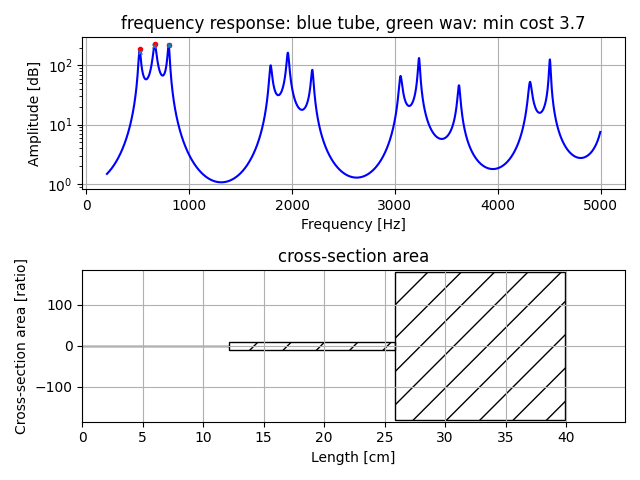
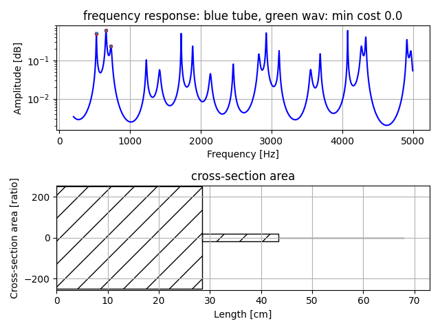
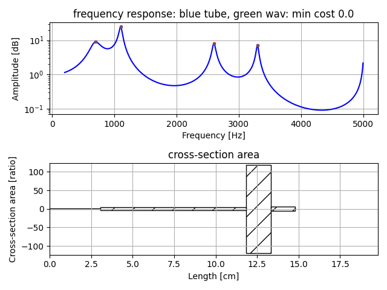
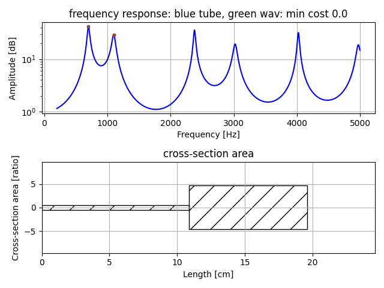

# Vocal Tube Estimation 2   

Estimation of two three four tube model from peak frequency.  
This version uses peak frequency ratio instead of absolute value.  


## usage   

make precomputed data of grid search to set initial value of downhill simplex method to estimate tube area and tube length.    
```
python pre_compute3.py   -t [number of tube]
```
[number of tube] is 2 or 3 or 4.  
It will save pks_dpks_stack_tube_use_ratio[number of tube].npz.  


estimate two three four tubes model from peak frequency.  
```
python pks2tube3.py  --peaks [list of peak frequency]
```
Number of elements in  [list of peak frequency] is as same as number of tube.  
It will show an example of tube area and tube length.  
In frequency response figure, cyan x mark means target peak frequency, and red dot mark means estimation result. They may differ some.  'min cost' means average of their difference.   

Example 1: three tube model estimation  
```
python pks2tube3.py  --peaks 523.3 659.358 800
```
    

Example 2: three tube model estimation  
```
python pks2tube3.py  --peaks 523.3 659.358 730
```
    

Example 3: four tube model estimation  
```
python pks2tube3.py  --peaks 700 1100 2600 3300
```
    

Example 4: two tube model estimation  
```
python pks2tube3.py  --peaks 700 1100
```
    


## License    
MIT  


