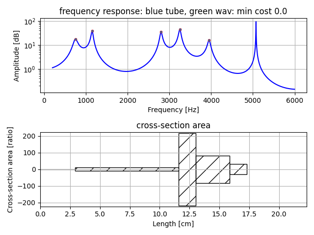
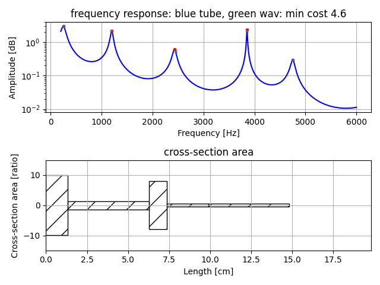
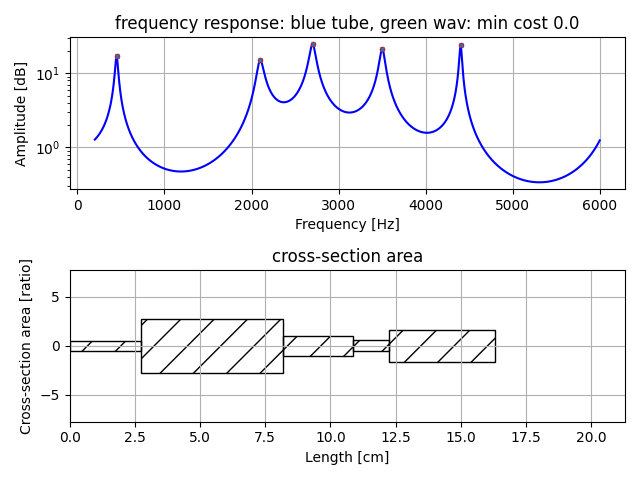

# Vocal Tube Estimation 2   

Estimation of five tube model from peak frequency.  
This version uses peak frequency ratio instead of absolute value.  
Estimation of five tube model is more difficult than estimation of 4 or less tube mode.  

## usage   

make precomputed data of grid search to set initial value of downhill simplex method to estimate tube area and tube length.    
```
python pre_compute5.py  -t 5
```
It will save pks_dpks_stack_tube_use_ratio5.npz.  Computing time will take several hours.  


estimate five tube model from peak frequency.  
```
python pks2tube5.py  --peaks [list of peak frequency]
```
Number of elements in  [list of peak frequency] is 5 as same as number of tube.  
It will show an example of tube area and tube length.  
In frequency response figure, cyan x mark means target peak frequency, and red dot mark means estimation result. They may differ some.  'min cost' means average of their difference.   

Example 1:  
```
python pks2tube5.py --peaks 750 1150 2800 3250 3950  
```
    

Example 2:  
```
python pks2tube5.py --peaks 250 2400 3200 3600 4300  
```
    

Example 3:  
```
python pks2tube5.py --peaks 250 1200 2450 3850 4750  
```
    

Example 4:  
```
python pks2tube5.py --peaks 450 2100 2700 3500 4400  
```
    

Example 5:  
```
python pks2tube5.py --peaks 450 780 2500 3000 3800  
```
    

## License    
MIT  


